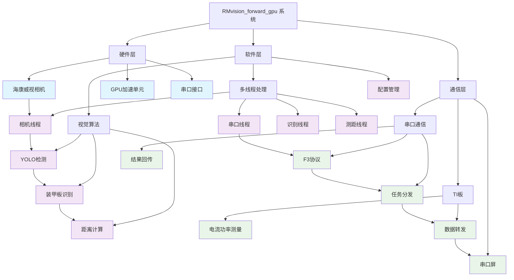

```mermaid

graph TB

    A[RMvision_forward_gpu 系统] --> B[硬件层]

    A --> C[软件层]

    A --> D[通信层]

    B --> B1[海康威视相机]

    B --> B2[GPU加速单元]

    B --> B3[串口接口]

    C --> C1[多线程处理]

    C --> C2[视觉算法]

    C --> C3[配置管理]

    D --> D1[串口通信]

    D --> D2[TI板]

    D --> D3[串口屏]

    C1 --> C1A[相机线程]

    C1 --> C1B[识别线程]

    C1 --> C1C[测距线程]

    C1 --> C1D[串口线程]

    C2 --> C2A[YOLO检测]

    C2 --> C2B[装甲板识别]

    C2 --> C2C[距离计算]

    D1 --> D1A[F3协议]

    D1 --> D1B[任务分发]

    D1 --> D1C[结果回传]

    D2 --> D2A[电流功率测量]

    D2 --> D2B[数据转发]

    %% 主要数据流

    B1 --> C1A

    C1A --> C2A

    C2A --> C2B

    C2B --> C2C

    C1D --> D1A

    D1A --> D1B

    D1B --> D2B

    D2B --> D3

    %% 样式

    classDef hardware fill:#e1f5fe

    classDef software fill:#f3e5f5

    classDef communication fill:#e8f5e8

    class B1,B2,B3 hardware

    class C1A,C1B,C1C,C1D,C2A,C2B,C2C,C3 software

    class D1A,D1B,D1C,D2A,D2B,D3 communication

```
