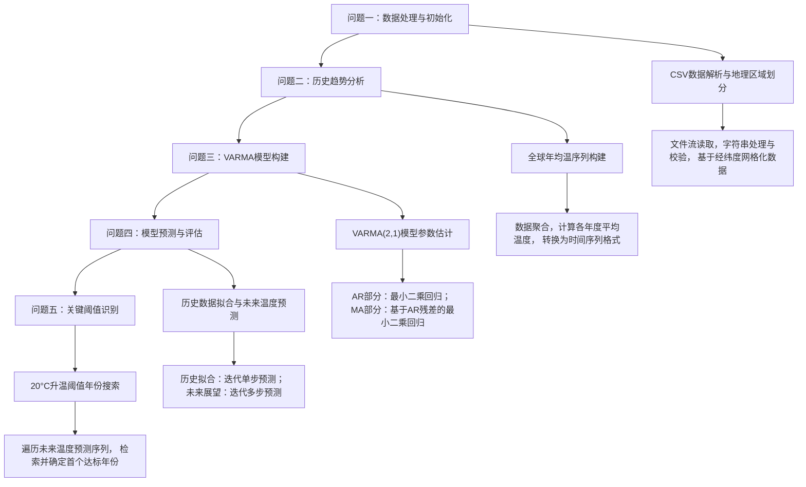

```mermaid
graph TD
    P1["问题一：数据处理与初始化"]
    P2["问题二：历史趋势分析"]
    P3["问题三：VARMA模型构建"]
    P4["问题四：模型预测与评估"]
    P5["问题五：关键阈值识别"]

    S1["CSV数据解析与地理区域划分"]
    M1["文件流读取，字符串处理与校验， 基于经纬度网格化数据"]

    S2["全球年均温序列构建"]
    M2["数据聚合，计算各年度平均温度， 转换为时间序列格式"]

    S3["VARMA(2,1)模型参数估计"]
    M3["AR部分：最小二乘回归； MA部分：基于AR残差的最小二乘回归"]

    S4["历史数据拟合与未来温度预测"]
    M4["历史拟合：迭代单步预测； 未来展望：迭代多步预测"]

    S5["20°C升温阈值年份搜索"]
    M5["遍历未来温度预测序列， 检索并确定首个达标年份"]

    %% 主流程连接
    P1 --> P2
    P2 --> P3
    P3 --> P4
    P4 --> P5

    %% 各问题内部流程
    P1 --> S1
    S1 --> M1

    P2 --> S2
    S2 --> M2

    P3 --> S3
    S3 --> M3

    P4 --> S4
    S4 --> M4

    P5 --> S5
    S5 --> M5
```

