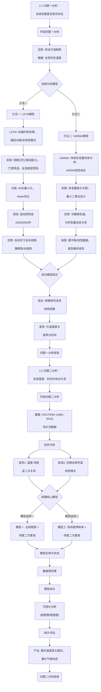

```mermaid

graph TD

    %% Problem 1 Section

    P1_MainTitle["2.1 问题一分析：

全球变暖是否真实存在"];

  

        P1_StartNode("开始问题一分析")

        P1_StartNode --> P1_GoalInfo["目标: 验证升温趋势

数据: 全球历史温度"];

        P1_GoalInfo --> P1_ModelChoice{"选择分析模型"};

  

        P1_ModelChoice -- "方法一" --> P1_LSTM_Path["方法一: LSTM模型"];

            P1_LSTM_Path --> P1_LSTM_Desc["LSTM: 优越时序处理，

捕捉长期/非线性模式"];

            P1_LSTM_Desc --> P1_LSTM_Mech["机制: 短期记忆(滑动窗口)，

门控筛选，全连接层预测"];

            P1_LSTM_Mech --> P1_LSTM_Train["训练: MSE最小化，

Adam优化"];

            P1_LSTM_Train --> P1_LSTM_Predict["预测: 滚动预测至

2030/2050年"];

            P1_LSTM_Predict --> P1_LSTM_Adv["优势: 自动学习复杂规律，

兼顾短/长趋势"];

            P1_LSTM_Adv --> P1_ConsolidatedResults{"综合模型结论"};

  

        P1_ModelChoice -- "方法二" --> P1_VARMA_Path["方法二: VARMA模型"];

            P1_VARMA_Path --> P1_VARMA_Desc["VARMA: 传统多变量时序分析，

AR/MA线性组合"];

            P1_VARMA_Desc --> P1_VARMA_Mech["机制: 多变量差分方程，

最小二乘法估计"];

            P1_VARMA_Mech --> P1_VARMA_Adv["优势: 可解释性强，

分析变量动态关系"];

            P1_VARMA_Adv --> P1_VARMA_Limit["局限: 需平稳/线性数据，

或忽略非线性"];

            P1_VARMA_Limit --> P1_ConsolidatedResults;

  

        P1_ConsolidatedResults --> P1_FinalConclusion["结论: 两模型均支持

持续变暖"];

        P1_FinalConclusion --> P1_KeyDifferences["差异: 升温速度与

临界点时间"];

        P1_KeyDifferences --> P1_EndNode("问题一分析结束");

    P1_MainTitle --> P1_StartNode;

  
  

    %% Problem 2 Section

    P2_MainTitle["2.2 问题二分析：

全球温度、时间与地点关系"];

    P1_EndNode --> P2_MainTitle;

  

        P2_StartNode("开始问题二分析")

        P2_StartNode --> P2_DataSource["数据: CRUTEM4 (1850–2016)

及补充数据"];

  

        P2_DataSource --> P2_InitialAnalysis_Step["初步分析"];

            P2_InitialAnalysis_Step --> P2_Finding1["发现1: 温度-纬度

呈二次关系"];

            P2_InitialAnalysis_Step --> P2_Finding2["发现2: 近期全球均温

线性增长"];

  

        P2_Finding1 --> P2_ModelBuilding_Decision{"构建核心模型"};

        P2_Finding2 --> P2_ModelBuilding_Decision;

  

        P2_ModelBuilding_Decision -- "模型选择一" --> P2_Model1_Desc["模型一: 全球趋势 +

纬度二次基准"];

        P2_ModelBuilding_Decision -- "模型选择二" --> P2_Model3_Desc["模型三: 各纬度带斜率 +

纬度二次基准"];

  

        P2_Model1_Desc --> P2_Methodology_Pipeline_Entry["模型应用与评估"];

        P2_Model3_Desc --> P2_Methodology_Pipeline_Entry;

  

            P2_Methodology_Pipeline_Entry --> P2_DataPreproc["数据预处理"];

            P2_DataPreproc --> P2_ModelFit["模型拟合"];

            P2_ModelFit --> P2_Visualize["可视化分析

(趋势图/残差图)"];

            P2_Visualize --> P2_StatEval["统计评估"];

  

        P2_StatEval --> P2_FinalGoal["产出: 揭示温度变化模式，

量化气候动态"];

        P2_FinalGoal --> P2_EndNode("问题二分析结束");

    P2_MainTitle --> P2_StartNode;

```