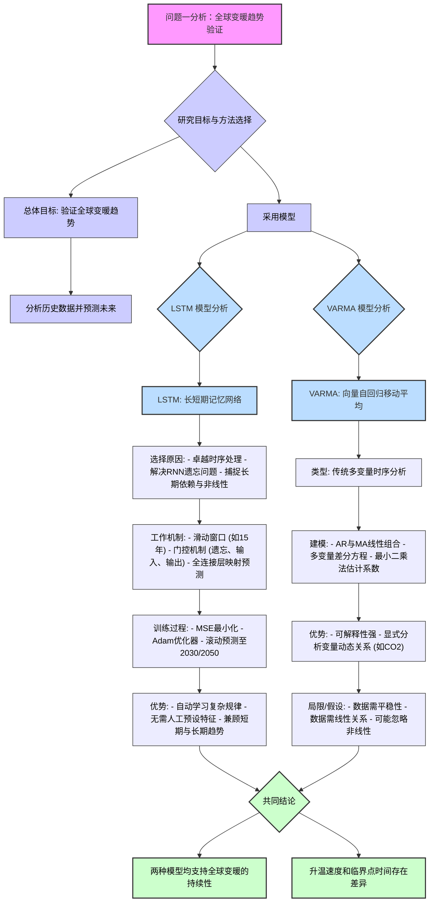

```mermaid
graph TD
    A["问题一分析：全球变暖趋势验证"] --> B{"研究目标与方法选择"};

    B --> C["总体目标: 验证全球变暖趋势"];
    C --> D["分析历史数据并预测未来"];

    B --> E["采用模型"];
    E --> LSTM_Branch{"LSTM 模型分析"};
    E --> VARMA_Branch{"VARMA 模型分析"};

    %% LSTM 分支
    LSTM_Branch --> LSTM_Desc["LSTM: 长短期记忆网络"];
    LSTM_Desc --> LSTM_Reason["选择原因: - 卓越时序处理 - 解决RNN遗忘问题 - 捕捉长期依赖与非线性"];
    LSTM_Reason --> LSTM_Mech["工作机制: - 滑动窗口 (如15年) - 门控机制 (遗忘、输入、输出) - 全连接层映射预测"];
    LSTM_Mech --> LSTM_Train["训练过程: - MSE最小化 - Adam优化器 - 滚动预测至2030/2050"];
    LSTM_Train --> LSTM_Adv["优势: - 自动学习复杂规律 - 无需人工预设特征 - 兼顾短期与长期趋势"];

    %% VARMA 分支
    VARMA_Branch --> VARMA_Desc["VARMA: 向量自回归移动平均"];
    VARMA_Desc --> VARMA_Type["类型: 传统多变量时序分析"];
    VARMA_Type --> VARMA_Model["建模: - AR与MA线性组合 - 多变量差分方程 - 最小二乘法估计系数"];
    VARMA_Model --> VARMA_Adv["优势: - 可解释性强 - 显式分析变量动态关系 (如CO2)"];
    VARMA_Adv --> VARMA_Limit["局限/假设: - 数据需平稳性 - 数据需线性关系 - 可能忽略非线性"];

    %% 共同结论
    Conclusion_Start{"共同结论"}
    LSTM_Adv --> Conclusion_Start;
    VARMA_Limit --> Conclusion_Start;
    Conclusion_Start --> Conc1["两种模型均支持全球变暖的持续性"];
    Conclusion_Start --> Conc2["升温速度和临界点时间存在差异"];

    %% Styling (Optional - remove if it causes issues)
    classDef title fill:#f9f,stroke:#333,stroke-width:2px,color:#333;
    classDef goal fill:#ccf,stroke:#333,stroke-width:1px,color:#000;
    classDef model fill:#bdf,stroke:#333,stroke-width:2px,color:#333;
    classDef detail fill:#lightgrey,stroke:#333,stroke-width:1px,color:#000;
    classDef conclusion fill:#cfc,stroke:#333,stroke-width:2px,color:#000;

    class A title;
    class B,C,D,E goal;
    class LSTM_Branch,VARMA_Branch,LSTM_Desc,VARMA_Desc model;
    class LSTM_Reason,LSTM_Mech,LSTM_Train,LSTM_Adv,VARMA_Type,VARMA_Model,VARMA_Adv,VARMA_Limit detail;
    class Conclusion_Start,Conc1,Conc2 conclusion;
```

